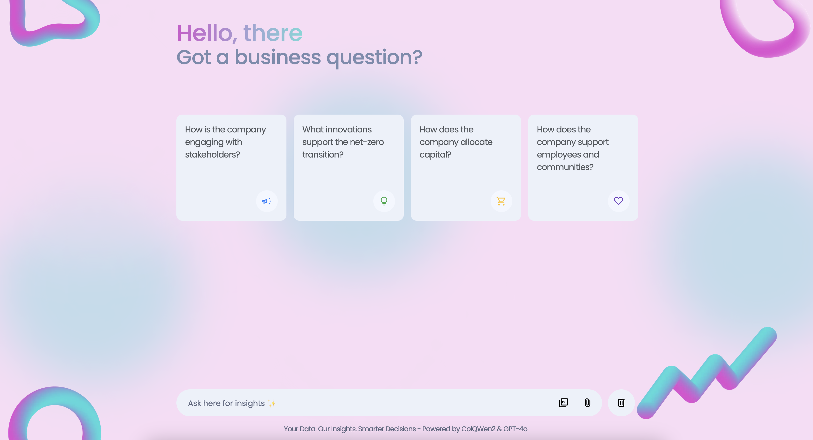
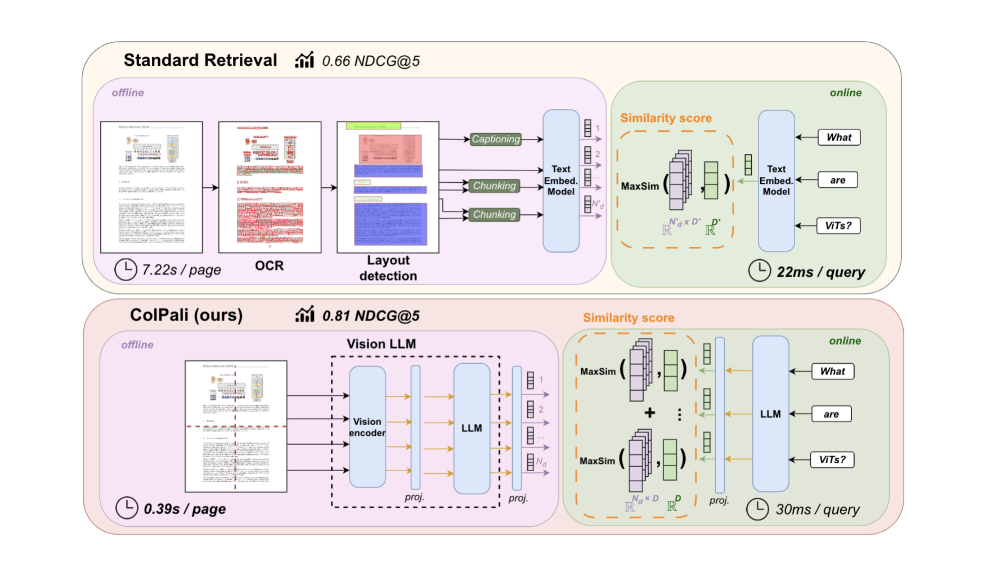
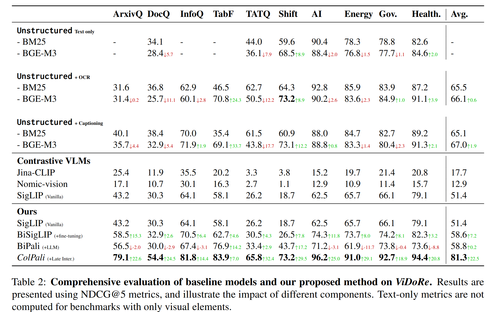

# Report-RAG

A RAG chatbot prototype that combines Vision Language Model (ColQWen2) based retrieval with GPT-4o for business report analysis. **Currently experimental** - best-effort results with room for improvement.


# Demo
[](https://youtu.be/w5iZgXIolJ8)

## 🔍 What is Report-RAG?
Combines two AI systems for document understanding:
1. **[ColQWen2](https://github.com/illuin-tech/colpali)** (local GPU)
   - Leverages visual components to produce high-quality contextualized embeddings
   - ColBERT-style multi-vector retrieval through late interaction mechanism
   - *No OCR required* - understands layout/charts visually
2. **GPT-4o** (API)
   - Generates answers using retrieved pages
3. **[Tesseract](https://github.com/tesseract-ocr/tesseract)**
   - Highlights key text regions

### Features:
- [X] ColQWen2 document indexing and retrieval
- [X] Pre-indexed PDFs
- [X] Custom PDF upload functionality
- [X] Top-2 page retrieval with highlights
- [X] JWT authentication


### TODO:
- [ ] Chat history persistence
- [ ] Batch PDF upload support
- [ ] Database for storing user data
- [ ] Enhanced highlighting accuracy
- [ ] Better prompt engineering

### Technical Debt:
- [ ] Add test suite
- [ ] Proper user auth storage
- [ ] Optimize ColPali model memory usage

**Why use a VLM model like ColQWen2(ColPali family) for RAG?**

Traditional document retrieval systems for RAG rely on complex text extraction pipelines involving OCR, layout parsing, chunking, and captioning to process documents. While effective, these pipelines suffer from critical limitations:

- **Unreliable and Slow Preprocessing:** Extracting text and visual elements (tables, figures) requires error-prone OCR and layout detection, adding significant latency to indexing.
- **Loss of Visual Context:** Text-only systems discard layout, fonts, and visual elements, which often encode critical semantic information (e.g., infographics, charts).

**ColPali’s Vision-Based Approach Addresses These Challenges:**

- **Stronger retrieval performance:** significantly outperforms text-only models on visually complex pages (e.g., tables, charts, and scanned documents) because it captures more of the page’s real-world structure and design.
- **End-to-End Visual Indexing:** Directly embeds document images using a Vision Language Model (VLM), bypassing OCR and layout parsing. This simplifies indexing and reduces latency by 6–15x.
- **Fewer parsing errors:** Traditional OCR can introduce noise or miss layout details. A vision model sees all signals—fonts, shapes, or even partial text—that a text-based approach might lose.


||
|:--:|
| **ColPali Overview - [paper](https://arxiv.org/abs/2407.01449)** |

||
|:--:|
| ViDoRe (Visual Document Retrieval Benchmark), is a comprehensive evaluation framework designed to assess retrievers on their capacity to retrieve visually rich information in docs, with tasks spanning various topics, modalities (figures, tables, text), and languages. **[paper](https://arxiv.org/abs/2407.01449)** |
|The improvement is especially pronounced in more visually intricate benchmark tasks, such as InfographicVQA, ArxivQA, and TabFQuAD, which correspond to infographics, figures, and tables, respectively.|

## ▶️ How to Run

### Prerequisites
- NVIDIA GPU (16GB+ VRAM)
- [NVIDIA Container Toolkit](https://docs.nvidia.com/datacenter/cloud-native/container-toolkit/latest/install-guide.html)
- Docker & Docker Compose
- OpenAI API key

### Setup
1. Clone repo and navigate to project root
2. Create `.env.production` from `.env.example`:
   ```bash
   cp .env.example .env.production
   ```
3. Edit `.env.production`:
   - Set `OPENAI_API_KEY`
   - Adjust other values as needed

### Launch
```bash
docker compose up --build
```
Access at `http://localhost:8000` after build completes (may take several minutes for initial embedding generation).

For production deployments, you can use Nginx as a reverse proxy to handle incoming HTTP requests.

## 🛠️ Project Structure
```
Report-RAG/
├── .env.example
├── backend/
│   ├── app/
│   │   ├── main.py
│   │   ├── config.py
│   │   ├── api/
│   │   ├── models/
│   │   ├── services/
│   │   └── utils/
│   ├── tests/
│   └── requirements.txt
├── data/
│   ├── [Sample PDFs]
│   ├── [Generated Embeddings]
│   ├── [Logs]
│   └── ...
├── docker-compose.yml
├── Dockerfile
└── frontend/
    └── static/
        ├── index.html
        ├── styles.css
        └── script.js
```

## ⚠️ Limitations (Prototype)
- Basic JWT implementation (in-memory)
- Accuracy varies with document types

For production use: Requires significant refinement of all components.

colqwen2 & Byaldi: The integration is subject to updates as Byaldi(pre-release) and ColPali-engine evolve. Keep track of library changes to maintain compatibility.
